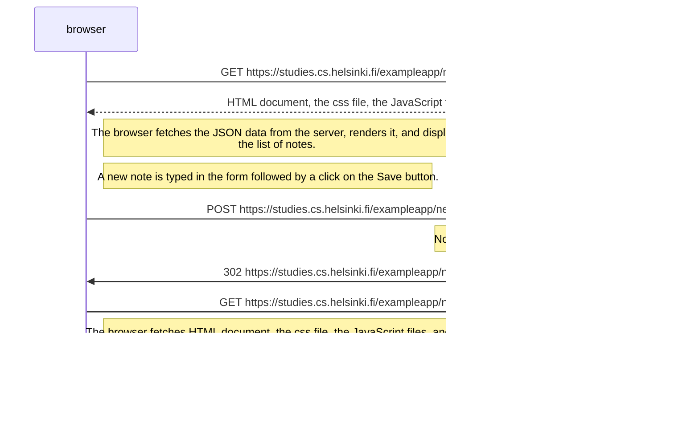

```mermaid

sequenceDiagram
    participant browser
    participant server

    browser->>server: GET https://studies.cs.helsinki.fi/exampleapp/notes
    activate server
    server-->>browser: HTML document, the css file, the JavaScript files
    deactivate server

    Note right of browser: The browser fetches the JSON data from the server, renders it, and displays <br> the list of notes. 
    Note right of browser: A new note is typed in the form followed by a click on the Save button. 
    
    browser->>server: POST https://studies.cs.helsinki.fi/exampleapp/new_note
    activate server
    Note left of server: Note saved. Redirect to `/notes`
    server->>browser: 302 https://studies.cs.helsinki.fi/exampleapp/notes
    browser->>server: GET https://studies.cs.helsinki.fi/exampleapp/notes
    
    Note right of browser: The browser fetches HTML document, the css file, the JavaScript files, and the JSON data from the server.
    Note right of browser: The browser executes the callback function that renders the notes
    deactivate server
```