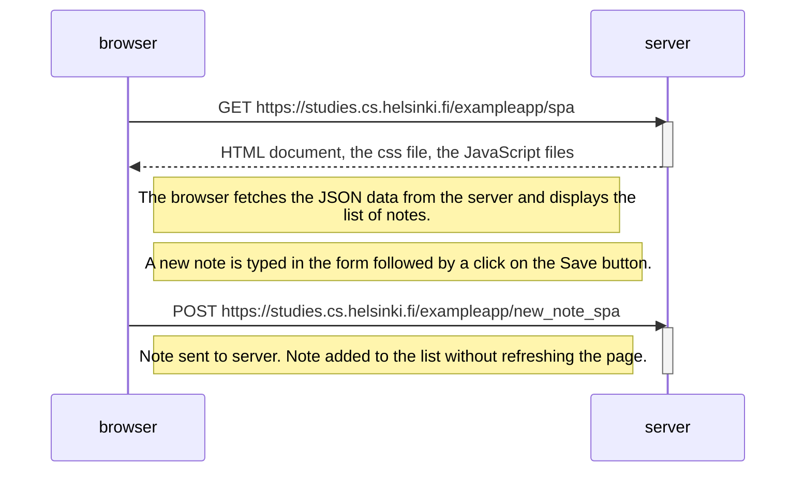

```mermaid

sequenceDiagram
    participant browser
    participant server

    browser->>server: GET https://studies.cs.helsinki.fi/exampleapp/spa
    activate server
    server-->>browser: HTML document, the css file, the JavaScript files
    deactivate server

    Note right of browser: The browser fetches the JSON data from the server and displays the <br>list of notes. 
    Note right of browser: A new note is typed in the form followed by a click on the Save button. 

    browser->>server: POST https://studies.cs.helsinki.fi/exampleapp/new_note_spa
    activate server
    Note right of browser: Note sent to server. Note added to the list without refreshing the page.
    deactivate server

```

